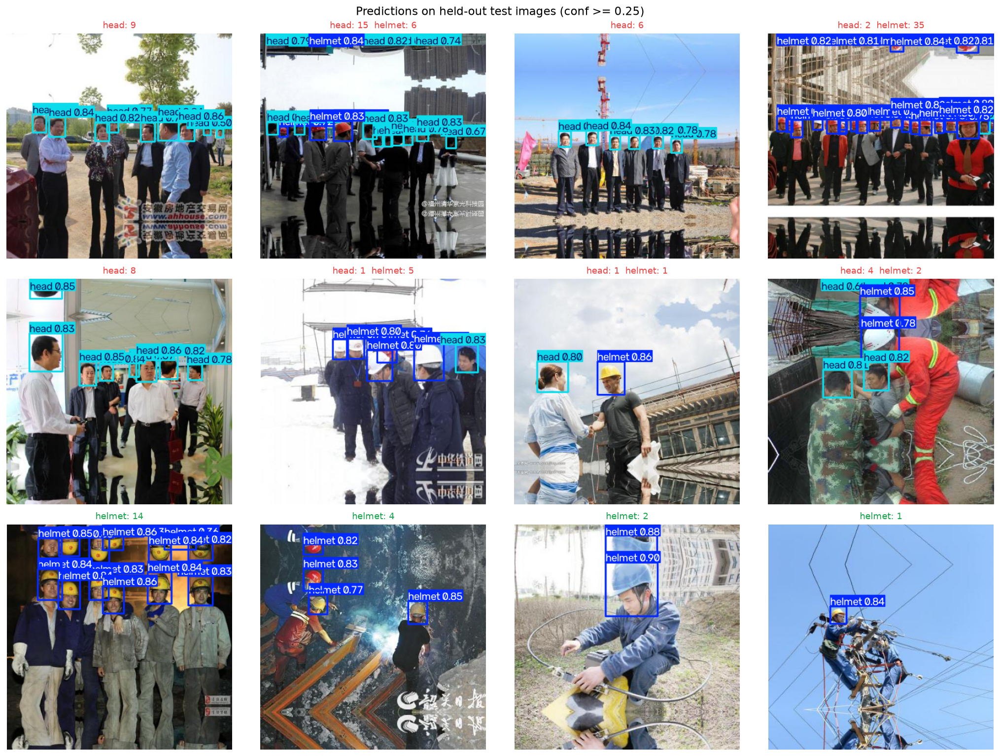

# Hard-Hat Detection — is this worker protected?

An object detector for construction-site safety compliance: it locates every head in
an image and labels it **`helmet`** or **`head`** (bare). The operational question is
not "where are the people" but "how many heads are unprotected right now", so the
demo app answers with a count and a verdict rather than only drawing boxes.

YOLOv8s fine-tuned on 5,000 annotated site photos. On the 500-image test split it
reaches **0.954 mAP@50** and **0.942 / 0.894** precision / recall, with the two
classes scoring within a point of each other — the rare bare-head class is not being
carried by the common helmet class.

```bash
python app.py                              # drop in a photo → compliance verdict
python predict_video.py --source 0         # live webcam with a running violation count
python evaluate.py --weights results/best.pt
```

The trained checkpoint is in the repo (`results/best.pt`, 21 MB), so the demo runs
without training anything.



---

## Quick start

```bash
python -m venv .venv && source .venv/bin/activate
pip install -r requirements.txt

python get_data.py           # 5,000 images + VOC annotations (~1.3 GB)
python prepare_dataset.py    # VOC → YOLO, stratified 70/20/10 split, writes data.yaml
python train.py              # YOLOv8s, 30 epochs, 416 px, batch 16 (3.5 h on an M3)
python evaluate.py --weights runs/detect/yolov8s_416px_30e/weights/best.pt
```

Only the last two steps need the dataset. To just use the model, skip straight to
`python app.py` — it loads `results/best.pt`.

`get_data.py` pulls from the Hugging Face mirror `Voxel51/hard-hat-detection`
(CC0-1.0, the same 5,000 files as Kaggle's `andrewmvd/hard-hat-detection`) so no
Kaggle account or API token is needed, and writes the boxes back out as Pascal VOC
XML — the exact layout Kaggle ships. Download from Kaggle instead and everything
downstream works unchanged.

## Results

Model selection is done by Ultralytics on the validation split; the test split is
touched exactly once, in `evaluate.py`. Both are reported, because a test score with
no validation score next to it hides how much was tuned.

**Test split** — 500 images

| class | precision | recall | mAP@50 | mAP@50-95 |
|---|---|---|---|---|
| helmet | 0.942 | 0.894 | 0.952 | 0.625 |
| head | 0.942 | 0.894 | 0.956 | 0.648 |
| **all** | **0.942** | **0.894** | **0.954** | **0.636** |

**Validation split** — 1,000 images, 4,744 boxes

| class | precision | recall | mAP@50 | mAP@50-95 |
|---|---|---|---|---|
| helmet | 0.940 | 0.889 | 0.955 | 0.629 |
| head | 0.902 | 0.859 | 0.894 | 0.583 |
| **all** | **0.921** | **0.874** | **0.925** | **0.606** |

Inference is 0.85 ms per image at 416 px on an M3 — the postprocessing (~8 ms) costs
an order of magnitude more than the network itself, which is worth knowing before
optimising the wrong half.

### The confidence threshold is a safety decision, not a default

`results/threshold_sweep.csv` sweeps the confidence threshold across the test split
and counts what each setting costs in the units that matter — bare heads missed
versus false alarms raised:

| conf | precision | recall | missed heads | false alarms |
|---|---|---|---|---|
| 0.15 | 0.785 | 0.960 | 24 | 159 |
| 0.25 | 0.852 | 0.937 | 38 | 98 |
| 0.40 | 0.915 | 0.907 | 56 | 51 |
| 0.50 | 0.942 | 0.887 | 68 | 33 |
| 0.70 | 0.977 | 0.712 | 174 | 10 |

A safety inspector and a dashboard want different rows of that table. Missing an
unprotected worker is not symmetric with flagging a protected one, so the honest
default is low (0.25) and the number is exposed as a flag rather than buried.

## Decisions worth knowing

**Two classes, not three.** The raw dataset has `helmet` (18,966 boxes), `head`
(5,785) and `person` (751). `person` marks a whole body rather than a head, so it
answers a different question than "is this worker protected?", and at 40× rarer than
`helmet` it would train badly anyway. `prepare_dataset.py` drops it — set
`KEEP_PERSON = True` for the three-class variant.

**A stratified split.** Only ~28% of images contain a bare head, and those are exactly
the images the use case is about. A plain random split can hand val and test a
noticeably different violation rate than train, which makes every metric harder to
trust, so images are split 70/20/10 *within* each group (has-a-bare-head versus
all-helmets).

**416 px, not 640.** 416 is the images' native size. The 30 epochs took 3.5 hours on an M3 through MPS as it is; Ultralytics' default 640 was
measured first and abandoned: on a 16 GB M3 it pushed unified memory past 7 GB, the
machine started swapping, and one iteration went from 1.0 s to roughly 50 s. Upscaling
past the source resolution bought nothing to pay for that.

**Hard links, not copies.** The YOLO split tree points at the same image bytes on
disk, so building it costs ~0 MB instead of another 250 MB.

## Layout

```
get_data.py            downloads 5,000 images + annotations, writes Pascal VOC XML
prepare_dataset.py     VOC → YOLO, stratified split, generates data.yaml
train.py               the exact configuration behind the reported numbers
evaluate.py            test-split evaluation; writes everything in results/
app.py                 Gradio demo — upload or webcam, returns a compliance verdict
predict_video.py       video file or live camera, with a running violation count
results/
  best.pt              the checkpoint that produced every number here
  metrics.json         every figure quoted above, machine-readable
  metrics.md           the same as tables
  threshold_sweep.csv  precision/recall/missed/false-alarm per confidence threshold
  *.png                confusion matrix, PR and F1 curves, training curves, examples
hard_hat_detection_yolo.ipynb   the whole pipeline as a notebook
```

`data.yaml` is generated by `prepare_dataset.py` and carries an absolute path — it is
regenerated rather than edited by hand, so the copy in the repo will point at whatever
machine ran it last.

## Notes

`data/` (1.3 GB), `runs/` (every Ultralytics checkpoint and curve) and `train.log` are
git-ignored — what is worth keeping is copied into `results/` by `evaluate.py`. The
dataset is CC0-1.0 via the Voxel51 mirror; the images are of real work sites and are
used here only to train and evaluate a detector.
